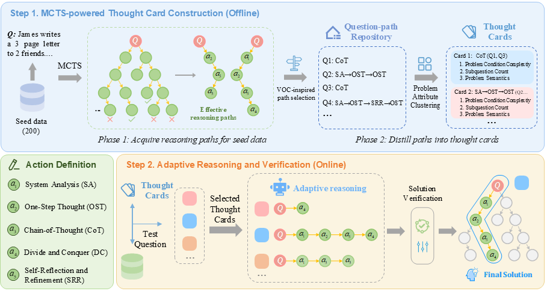

# Automated In-Context Reasoning for Large Language Models
This repository is the official implementation of "Automated In-Context Reasoning for Large Language Models".

## Contents
- [Introduction](#Introduction)
- [Requirements](#Requirements)
- [Usage](#Usage)
- [Acknowledgement](#Acknowledgement)


## Introduction

We introduces **AutoICR**, a High-level **Auto**mated **I**n-**C**ontext **R**easoning paradigm to enhance the complex reasoning capabilities of large language models. Unlike traditional in-context learning, AutoICR shifts the focus from example-based analogical learning to abstract thought patterns.

<p align="center">
  
    <br>
    <em>Figure 1: Schematic comparison between AutoICR and traditional zero-shot and few-shot in-context learning methods using a teacher-student paradigm.</em>
</p>

Our approach begins by defining five atomic reasoning actions, upon which we employ Monte Carlo Tree Search to systematically construct high-level reasoning patterns. During inference, AutoICR dynamically selects appropriate reasoning patterns based on problem attributes, providing explicit guidance for the model’s reasoning process.

Specifically, **AutoICR** consists of two main components:
- *MCTS-powered Thought Card Construction*: Leverage MCTS to systematically construct high level thought cards, which effectively guides subsequent problem-solving.
- *Adaptive Reasoning and Verification*: Dynamically select and execute optimal reasoning patterns based on the problem's cognitive complexity, followed by solution verification.

The flowchart of our method AutoICR is shown below:
<p align="center">
  
    <br>
    <em>Figure 2: Flowchart of our method AutoICR. This framework consists of two main parts: (1) MCTS-Powered Thought Card Construction; and (2) Adaptive Reasoning and Verification.</em>
</p>


## Requirements

We recommend using conda for environment management and executing the code on an A100 80G GPU equipped with CUDA 12.4.

1. Create a Python environment with python 3.10: 
```
conda create -n hiaricl python==3.10
conda activate hiaricl
```

2. Install requirements
```
pip install --upgrade pip
pip install -r requirements.txt
```


## Usage
>  AutoICR consists of two steps, and our released code implements an efficient parallel tree search. *Note that, to ensure fair comparison with other methods such as rStar, the time cost reported in our paper corresponds to the non-parallelized version, following the same measurement protocol adopted in previous works.*
In practical applications, however, employing the parallel implementation provided in this repository can lead to substantially improved efficiency.

### Step 1: Construct high-level thought cards via MCTS
Using a small seed dataset, we derive reasoning paths (Phase 1) and distill them into multiple thought cards (Phase 2). These cards serve as prior insights for testing stage, facilitating efficient adaptive reasoning.

#### *Phase 1: Acquire reasoning paths for seed data*
You may choose to use the following command to acquire reasoning paths for each question in seed dataset, which is guided by MCTS. To achieve this, you should first obtain a seed dataset by randomly sampling from a single dataset or by combining multiple datasets, such as in a multi-task system.
```bash
bash scripts/generate_paths.sh
```

The script `generate_paths.sh` includes several configurable parameters:
- `--dataset_name`: Name of the dataset (e.g. MATH).
- `--test_json_filename`: Filename for the seed data (default: train_all).
- `--model_ckpt`: Path to the model checkpoint (e.g. meta-llama/Meta-Llama-3-8B-Instruct).
- `--num_rollouts`: Number of rollouts (default: 8).

>  ⚠️ Make sure to adjust these parameters according to your requirements. Note that if the vllm server fails to start, you can remove 'nohup' and run it in the foreground for debugging errors. Based on our experimental experience, the most likely causes are port errors or incorrect MODEL_NAME paths. Moreover, if the vllm server starts successfully but you encounter connection errors when running the generate file, the port in models/OpenAI_API.py might not match the port used when starting vllm.


#### *Phase 2: Distill paths into thought cards*
After executing MCTS, we obtain a tree structure for each seed dataset question, yielding multiple valid reasoning paths. Subsequently, we distill thought cards based on the proposed metrics, including subquestion count, problem condition complexity, and semantic similarity.
```bash
CUDA_VISIBLE_DEVICES="0" python distill.py
```


### Step 2: Adaptive Reasoning Pattern Selection
Note that in the previous step implemented in ```distill.py```, we have pre-matched the optimal five cards for each question in the test set. Therefore, during the testing phase, these pre-matched cards can be directly utilized. Alternatively, metric calculation and card matching can also be performed during the MCTS testing phase.

#### *Reasoning*
Using selected thought cards as templates, our method maintains the benefits of tree-structured reasoning without extensive node expansion. By following the specified action sequences on thought cards (e.g., SA → OST → CoT), the LLM decomposes the reasoning process into a series of sequential steps, generating multiple valid candidate solutions for the test question. Each step corresponds to a distinct atomic action, thus ensuring structured and systematic reasoning throughout the inference process.
```bash
bash scripts/generate_test.sh
```

The script `generate_test.sh` includes several configurable parameters:
- `--dataset_name`: Name of the dataset (e.g. MATH).
- `--test_json_filename`: Filename for the seed data (default: test_all).
- `--model_ckpt`: Path to the model checkpoint.
- `--attribute_type`: Type of cognitive complexity (e.g. condition).

>  ⚠️ Make sure to adjust these parameters according to your requirements.

#### *Verification*
Identifying the most accurate reasoning trajectory among multiple candidate solutions represents a critical challenge. We investigate three verification methods: process-supervision, outcome-supervision, and self-consistency. We use process-supervision method by default.
```bash
CUDA_VISIBLE_DEVICES="0" python verification.py --type consistency --score_type product --k 0.95
```
You can adjust the corresponding verification methods according to your requirements.


## Acknowledgement
- [rStar](https://github.com/zhentingqi/rStar): We start our codebase from rStar.
- [RLHFlow-PRM-Mistral-8B](https://huggingface.co/RLHFlow/Llama3.1-8B-PRM-Mistral-Data): We utilize this process reward model by default.
- [vllm](https://github.com/vllm-project/vllm): We adopt this fantastic framework.
